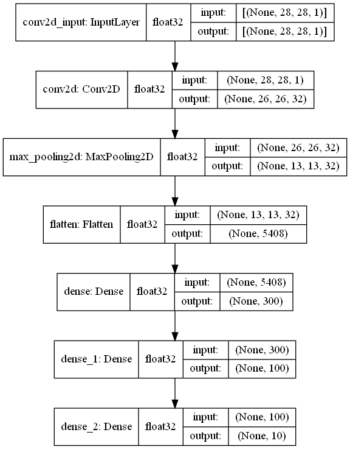
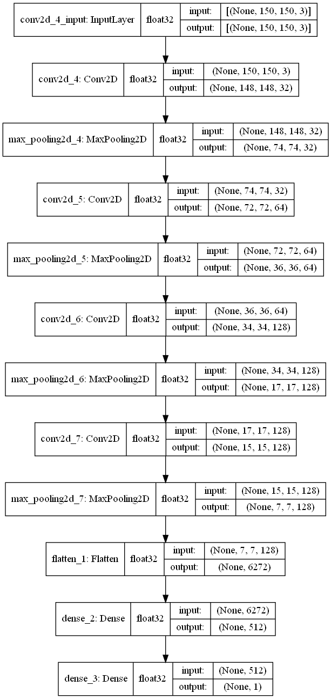
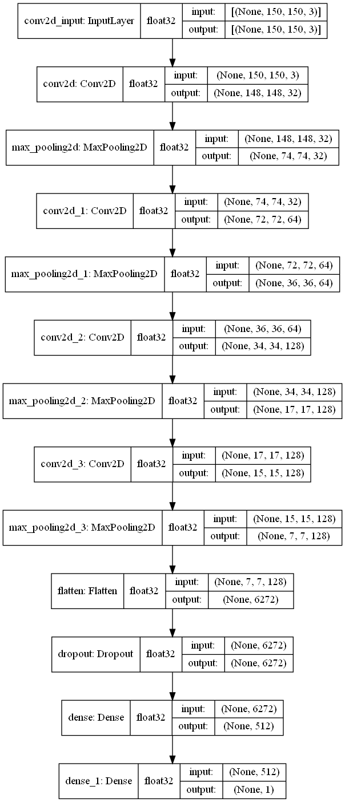
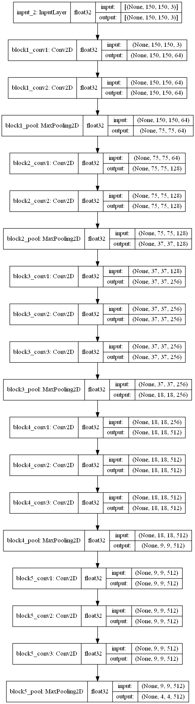

# CNN-part-1

> We use TensorFlow + Keras to build models

We have 4 models Convolutional neural network (CNN) :

1. CNN (fashion_mnist dataset)
2. CNN (v01) (cats_and_dogs_small dataset)
3. CNN With data augmentation (v02) (cats_and_dogs_small dataset)
4. CNN With VGG-16 With data augmentation (v03) (cats_and_dogs_small dataset)
5. CNN With VGG-16 With data augmentation With Unfreeze the base model (v04) (cats_and_dogs_small dataset)

> we find them in `CNN.ipynb` , `Project.ipynb` and `VGG-16.ipynb`

---

## (cats_and_dogs_small dataset)

[cats_and_dogs_small.zip - Google Drive](https://drive.google.com/file/d/16AlwTDOeyFaiP3RPxKOk5s80IycK80X4/view)

---

## 1. CNN (fashion_mnist dataset)

This model is `cnn_fashion_mnist.h5`

we find code in `CNN.ipynb` => [Code view here 👨‍💻](https://nbviewer.jupyter.org/github/ahmedatef1610/CNN-part-1/blob/main/CNN.ipynb)

<!--  -->

---

## 2. CNN (v01) (cats_and_dogs_small dataset)

This model is `project_V01.h5`

we find code in `Project.ipynb` => [Code view here 👨‍💻](https://nbviewer.jupyter.org/github/ahmedatef1610/CNN-part-1/blob/main/Project.ipynb)

<!--  -->

---

## 3. CNN With data augmentation (v02) (cats_and_dogs_small dataset)

This model is `project_V02.h5`

we find code in `Project.ipynb` => [Code view here 👨‍💻](https://nbviewer.jupyter.org/github/ahmedatef1610/CNN-part-1/blob/main/Project.ipynb)

<!--  -->

---

## 4. CNN With VGG-16 With data augmentation (v03) (cats_and_dogs_small dataset)

This model is `project_V03.h5`

we find code in `Project.ipynb` => [Code view here 👨‍💻](https://nbviewer.jupyter.org/github/ahmedatef1610/CNN-part-1/blob/main/Project.ipynb)

We not change weights in convolutional base VGG-16 ( freeze the base model ) and train only fully connected neural network

<!--  -->

VGG-16 Architecture :

<!--  -->

---

## 5. CNN With VGG-16 With data augmentation With Unfreeze the base model (v04) (cats_and_dogs_small dataset)

This model is `project_V04.h5` (download model weights from [here](https://drive.google.com/file/d/1QR8SlQggBtn_A8EI77RtejgX3NiY9RWe/view?usp=sharing) )

we find code in `VGG-16.ipynb`  => [Code view here 👨‍💻](https://nbviewer.jupyter.org/github/ahmedatef1610/CNN-part-1/blob/main/VGG-16.ipynb)

We change weights in convolutional base VGG-16 ( Unfreeze the base model ) and train fully connected neural network

<!--  -->

VGG-16 Architecture :

<!--  -->

---
