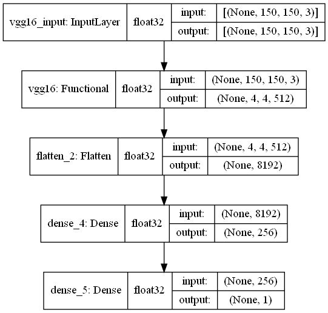

# CNN-part-1

> We use TensorFlow + Keras to build models

We have 4 models Convolutional neural network (CNN) :

1. CNN (fashion_mnist dataset)
2. CNN (v01) (cats_and_dogs_small dataset)
3. CNN With data augmentation (v02) (cats_and_dogs_small dataset)
4. CNN With VGG-16 With data augmentation (v03) (cats_and_dogs_small dataset)

> we find them in `CNN.ipynb` and `Project.ipynb`

---

## (cats_and_dogs_small dataset)

[cats_and_dogs_small.zip - Google Drive](https://drive.google.com/file/d/16AlwTDOeyFaiP3RPxKOk5s80IycK80X4/view)

---

## 1. CNN (fashion_mnist dataset)

This model is `cnn_fashion_mnist.h5`

---

## 2. CNN (v01) (cats_and_dogs_small dataset)

This model is `project_V01.h5`

---

## 3. CNN With data augmentation (v02) (cats_and_dogs_small dataset)

This model is `project_V02.h5`

---

## 4. CNN With VGG-16 With data augmentation (v03) (cats_and_dogs_small dataset)

This model is `project_V03.h5`

VGG-16 Architecture :

---
